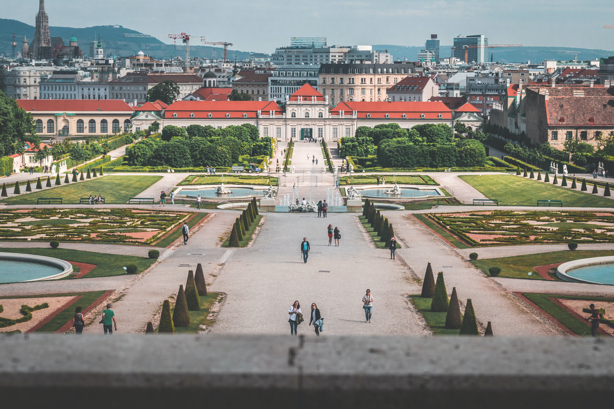
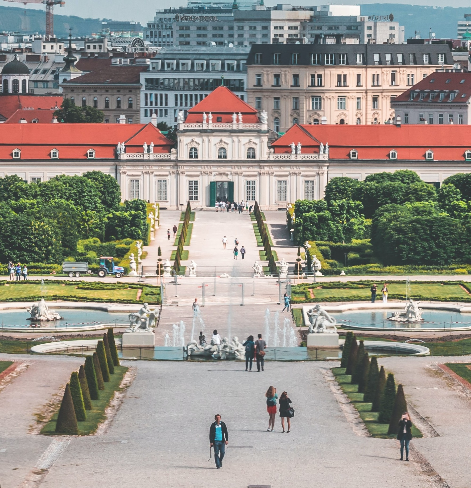
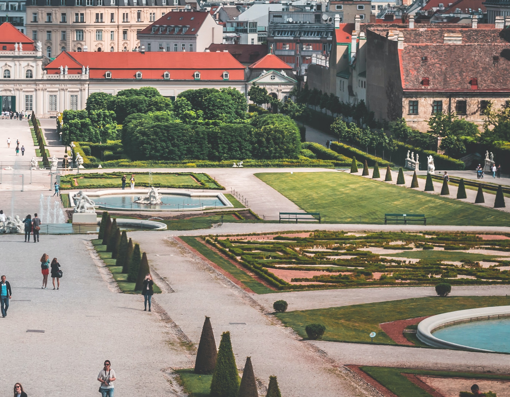
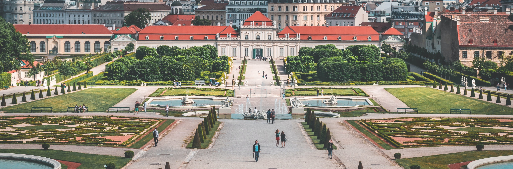
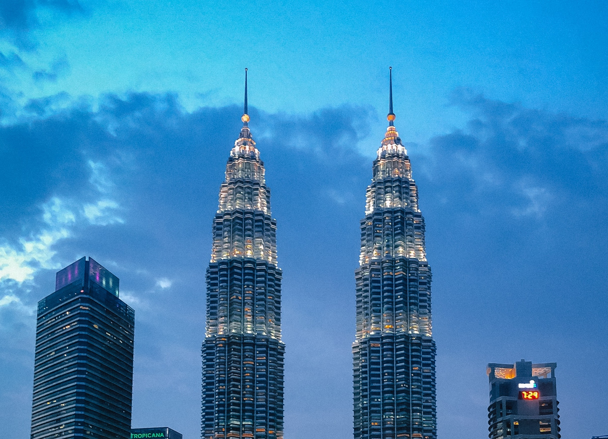
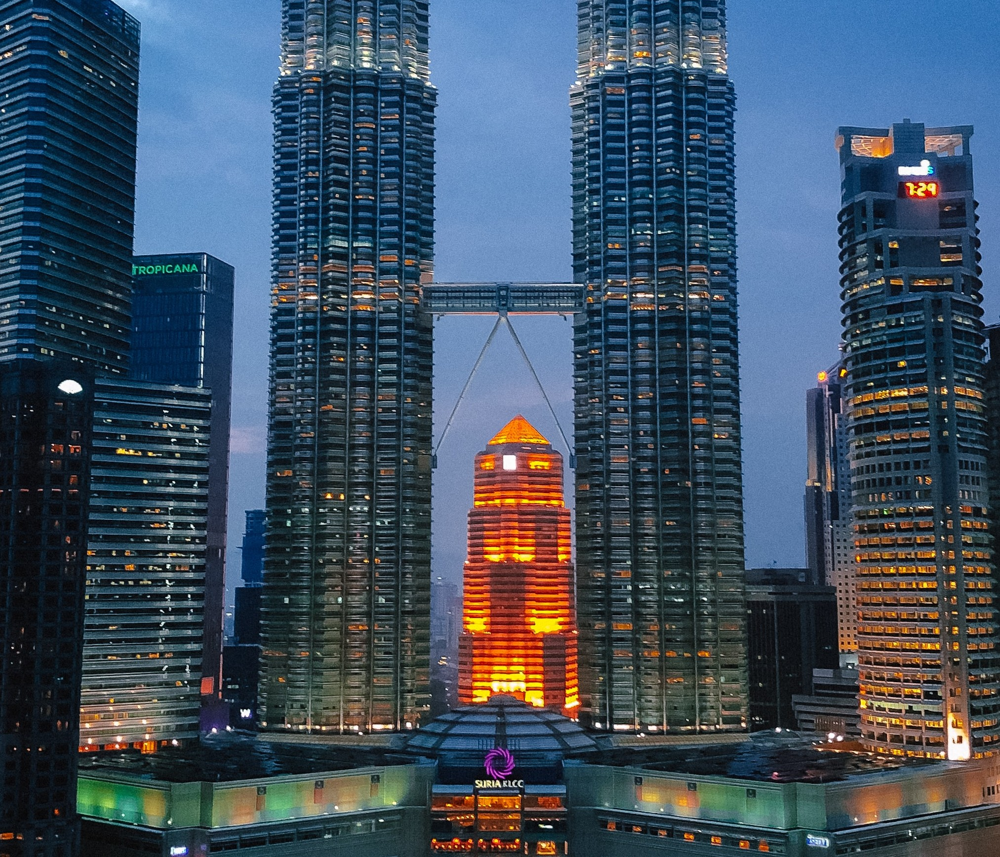
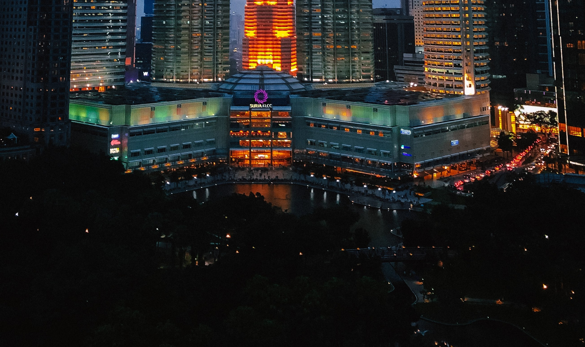
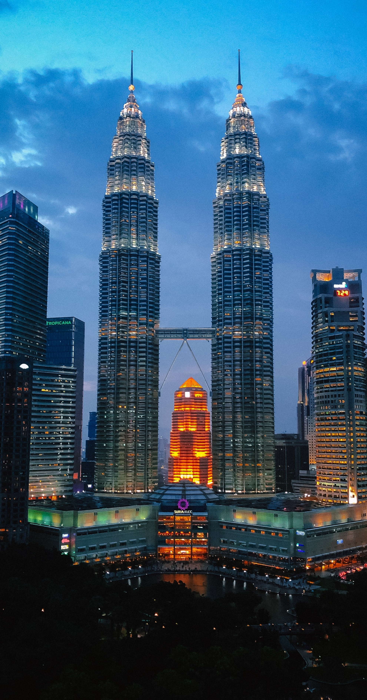

# A python package to stitch multiple images

[]()
[](https://www.codefactor.io/repository/github/brianpinto91/image-stitching)

This package provides an elegant function to stitch images from a scene either horizontally or vertically.

## Table of Contents
* [Installation](#installation)
* [Usage](#usage)
* [Implementation](#implementation)
* [Demo](#demo)
* [License](#license)

## Installation

Currently the package can be installed from [TestPyPi][testpypi_link] python software repository. Once the project is finalized it will be available on [PyPi][pypi_link].

To install the package, you can use the **PIP** installer for python using the command:

```sh
$ pip install -i https://test.pypi.org/simple/ imgstitch
```

## Usage

There are two functions that can be primarily used:
 
#### `stitch_images(image_folder, image_filenames, stitch_direction)`

 Args:

 - **`image_folder`**  `str` `required`
    
    path of the directory containing the images
 - **`image_filenames`**  `list` `required`
    
    a list of image file names in the order of stitching.
 - **`stitch_direction`**  `int` `required`
    
    direction of stitching. Uses numpy convention. Use 0 for stitching along image height or vertical stitching. And use 1 for stitching along image width or horizontal stitching.

Returns:
 - **`stitched_image`**  `numpy array`

    a numpy array of representing the stitched image. The channels will be in the opencv convention that is BGR.

#### `stitch_images_and_save(image_folder, image_filenames, stitch_direction, output_folder="output")`

 Args:

 - **`image_folder`**  `str` `required`
    
    path of the directory containing the images
 - **`image_filenames`**  `list` `required`
    
    a list of image file names in the order of stitching.
 - **`stitch_direction`**  `int` `required`
    
    direction of stitching. Uses numpy convention. Use 0 for stitching along image height or vertical stitching. And use 1 for stitching along image width or horizontal stitching.
 - **`output_folder`**  `str`  `optional` `default = "output"`

    the directory to which the stitched image is to be saved. By default a directory named "output" is created in the parent directory of your python script which uses this function. 

Returns:
 - **`None`**

    The image is saved in the specified directory or the default directory with a time stamp attached to the filename (stitched_image_yyyymmdd_hhmmss.jpg)

## Implementation

For keypoints and feature detection, the **Oriented FAST and Rotated BRIEF (ORB)** [[1]](#1) algorithm is used from the **opencv** package.

Once the keypoints and features descriptors are obtained from a pair of images, **brute-force-matching** is performed using **hamming distance** as the metric. For each point in one image, two points with lowest **hamming distance** in the other image is obtained first. Later only those points are filtered where the two lowest **hamming distance** points for any point have difference greater than a certain threshold.

With a list of matched points between two images, the homography matrix can be computed. However there can be oulier matches. In order to minimize the effect of outliers and to obtain the best homography matrix, **RANSAC** [[2]](#2) algorithm is used.

Once a homography is obtained from one image to the other image, **opencv's** warp perspective function is used to transform the second image into the perspective of the first. The resultant image might be warped edges because of the change in perspective. Also, if the images are not of the same size, then there would be empty pixels in the stitched image. Therefore, I have implemented a method to elegantly remove these empty pixels and retain the maximum image information between a pair of images.

## Demo

I took a single picture of a scene, and then randomly selected overlapping parts from the picture to get three separate parts representing a scene. Of course, this represents perfect conditions for stitching images because them come from a single camera shot. 

### **Horizontal stitching**

The original photo is by [Daniel Plan][scene_a_img_src] obtained through [Unsplash][unsplash_link]. The cropped parts of the original image before stitching in the order from left to right of a scene are shown as below:

(The images are cropped at different height and width to show the elegant way the stitching is performed to get the maximum content from all the images)

<div style="text-align: center">
    
     
    
</div>

And the stitched image is:

<div style="text-align: center">
    
</div>


### **Vertical stitching**

The original photo is by [Ismael Bashiri][scene_b_img_src] obtained through **Unsplash**. The cropped parts of the original image before stitching in the order from top to bottom of a scene are shown as below:

<div style="text-align: center">
    
     
    
</div>

And the stitched image is:

<div style="text-align: center">
    
</div>

## License
[](LICENSE.md)

Copyright 2021 Brian Pinto

## References
<a id="1">[1]</a>
E. Rublee, V. Rabaud, K. Konolige and G. Bradski, "ORB: An efficient alternative to SIFT or SURF," 2011 International Conference on Computer Vision, Barcelona, 2011, pp. 2564-2571, doi: 10.1109/ICCV.2011.6126544.

<a id="2">[2]</a>
Fischler, Martin A., and Robert C. Bolles. "Random sample consensus: a paradigm for model fitting with applications to image analysis and automated cartography." Communications of the ACM 24.6 (1981): 381-395. 

[testpypi_link]: https://test.pypi.org/
[pypi_link]: https://pypi.org/
[scene_a_img_src]: https://unsplash.com/photos/OE7jKpsk7uU
[scene_b_img_src]: https://unsplash.com/photos/GdjZs5JZwZA
[unsplash_link]: https://unsplash.com/